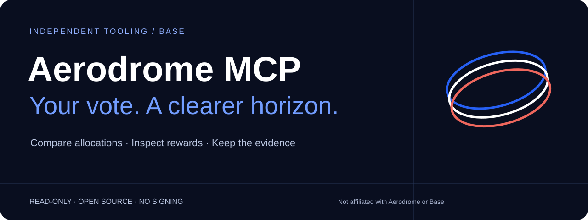

# Aerodrome MCP for Base

**Compare voting allocations, inspect rewards, and keep a private decision record.**

A local MCP server for Aerodrome on Base mainnet (chain ID 8453). Compare your current veNFT voting positions and bounded claimable rewards against a saved snapshot, or compare selected pools' voting evidence.

Independent community project. Not affiliated with Aerodrome or Base. This release supports **Aerodrome only**, not every protocol on Base.

Version: **0.5.2**. License: MIT.

[Integration guide](INTEGRATION.md) · [Demo source and setup](INTEGRATION.md) · [Security boundaries](SECURITY.md) · [Brand notes](BRAND.md)

## Quick start

Requires Node.js 24 or newer and npm.

```sh
git clone https://github.com/Alubiama/aerodrome-mcp-base.git
cd aerodrome-mcp-base
```

From your local repository checkout:

```sh
npm ci --ignore-scripts
npm run typecheck
npm test
npm run demo
```

The demo uses synthetic data, a real local MCP connection and temporary storage. It needs no wallet, network, API key or model. It shows an address-only overview followed by `BASELINE_CREATED` and `COMPARED`, with a test reward amount increasing from 100 to 125 raw units.

To set optional local wallet defaults:

```sh
cp config.example.json config.json
```

Local configuration is optional for public protocol/pool reads and for `wallet_overview` with an explicit wallet address. If using `config.json`, replace its **synthetic** wallet with your public address. `veNftTokenIds` may be empty; the overview discovers owned IDs automatically. Configured snapshot/change tools continue to use the explicitly configured IDs. Add gauge addresses only if you want LP rewards checked. Never enter a seed phrase or private key. Unknown configuration fields are rejected. Configured veNFT ownership is checked for wallet reward reads.

## Connect an MCP client

Use absolute paths for your checkout and Node executable:

```json
{
  "mcpServers": {
    "aerodrome": {
      "command": "/absolute/path/to/node",
      "args": [
        "--import", "/absolute/path/to/aerodrome-mcp-base/node_modules/tsx/dist/loader.mjs",
        "/absolute/path/to/aerodrome-mcp-base/src/mcp/index.ts"
      ]
    }
  }
}
```

Use a client tool timeout of **150 seconds**. The server deadline is 120 seconds; concurrency is capped at two active reads. Paths are resolved relative to the checkout, so launching from another directory works. Run Node directly for stdio; do not put npm banners on the protocol stream.

For Codex, add the equivalent `[mcp_servers.aerodrome]` table to project `.codex/config.toml` in a trusted project, with `command`, `args`, `startup_timeout_sec = 20` and `tool_timeout_sec = 150`.

## Ask your assistant

- “What changed in my wallet since the last check?”
- “Show my current Aerodrome voting positions and bounded rewards.”
- “Compare the voting weights and gauge status of these pool addresses: …”

The server exposes 14 tools:

| Tool | Purpose |
| --- | --- |
| `aerodrome_pool_directory` | Newest voting-pool registrations, paginated, with pair metadata |
| `aerodrome_voting_incentives` | Epoch deposits and conditional vote-allocation estimates in reward-token units |
| `aerodrome_protocol_status` | Official contract identity, block, epoch and protocol weights |
| `aerodrome_voting_position` | Configured or supplied veNFT voting positions |
| `aerodrome_wallet_rewards` | Current-vote reward scope and explicitly configured LP gauges |
| `aerodrome_wallet_accounting` | Receipt-backed escrow cash flows, selected voting-pool rewards and rebases, with independent end-block holdings |
| `aerodrome_wallet_overview` | Address-first balances, automatic veNFT discovery, locks, voting, rewards and an English brief |
| `aerodrome_wallet_snapshot` | All wallet sections at one block with a final block-hash recheck |
| `aerodrome_compare_pools` | 2–16 distinct pool addresses; voting evidence, not investment ranking |
| `aerodrome_wallet_changes` | Capture with a UUID `requestId`; retry the same ID to recover the same report |
| `aerodrome_wallet_report` | Retrieve a saved report by `reportId`, without RPC or baseline changes |
| `aerodrome_compare_allocations` | Compare simultaneous splits and competing-vote sensitivity on one pinned block |
| `aerodrome_decision_card` | Export a private draft or explicitly selected allocation card |
| `aerodrome_reward_plan` | Bounded retention and direct-USDC quote scenarios for explicit veNFT selections; never executes a trade |

## Discover pools and inspect voting incentives (0.3)

`aerodrome_pool_directory` reads up to 16 registry slots (default 8), newest first. Use `nextBeforeIndex` as the next request's `beforeIndex`; the cursor advances over examined slots, including failed rows. To check registrations since a previous observation, pass its `totalPoolCount` as `sinceIndex`. A first page is not a complete market scan. Registry order means **gauge registration**, not token listing date or pool creation time. Pair token addresses are authoritative within the RPC evidence; symbols are untrusted labels. Missing metadata stays partial.

```json
{"name":"aerodrome_pool_directory","arguments":{"limit":8}}
```

Use discovered or explicitly chosen addresses in `aerodrome_voting_incentives` (1–8 pools). With no scenario input it returns current-epoch deposited bribes and fees only. Reward-token scans are limited to 8 entries per contract by default (maximum 16); truncation and failed reads remain visible.

For hypothetical full allocation, supply 1–4 normal veNFT `tokenIds`. Current voting power is read on chain; existing balances in each reward contract are subtracted before adding the proposed allocation. Each pool is a separate alternative using all supplied voting power, not simultaneous allocations. This does not establish wallet ownership, eligibility, delegation or transaction success. Non-normal positions or unavailable inputs suppress estimates.

Alternatively, `additionalVoteRaw` models new marginal voting weight and does not remove any existing votes. It is mutually exclusive with `tokenIds`. Raw voting power uses the escrow token's units; do not pass a human-readable token amount as a raw integer.

```json
{"name":"aerodrome_voting_incentives","arguments":{"pools":["0x0000000000000000000000000000000000000010"],"tokenIds":["1"]}}
```

The address and ID above are synthetic: replace them with actual discovered values. The response distinguishes deposited amounts from `estimatedRewardRaw` / `estimatedRewardFormatted`. `candidateVoteRaw`, `removedExistingVoteRaw` and `scenarioDenominatorRaw` expose the calculation. Full-allocation estimate per reward token:

```text
depositedRaw * candidateVoteRaw / (totalSupplyRaw - removedExistingVoteRaw + candidateVoteRaw)
```

Integer division rounds down. Estimates are in each reward token separately; tokens must not be summed or ranked by raw amounts. Zero deposits now do not imply zero final-epoch rewards. Votes and deposits may change before epoch end. Actual claimable rewards use epoch-end checkpoints, not this current-state scenario. No token prices, USD APR, liquidity/volume ranking or guaranteed payout is provided. Unknown decimals leave formatted values null. Dead gauges remain visible with no estimates.

The source basis is the official [Voter registration logic](https://github.com/aerodrome-finance/contracts/blob/main/contracts/Voter.sol) and [Reward accounting](https://github.com/aerodrome-finance/contracts/blob/main/contracts/rewards/Reward.sol). All RPC reads are pinned to one block, with a final hash recheck and bounded request lifetime.

## One-address overview

```json
{"name":"aerodrome_wallet_overview","arguments":{"wallet":"0x0000000000000000000000000000000000000002"}}
```

Use your own public address instead of the synthetic example. No manual veNFT IDs or local config are required. The result separates:

- Liquid ETH, the escrow's underlying token (AERO), configured USDC and up to 16 extra `tokens` supplied by address. This is a bounded token list, not all assets in a wallet.
- Up to 16 directly owned veNFTs from the official escrow owner list, with verified ownership, normal locked principal and unlock time.
- Current voting power and epoch state. The normal voting window alone does not establish transaction eligibility or success.
- Current-vote rewards and up to 16 explicitly supplied `gauges`. Configured gauges are inherited only for the same configured wallet. LP principal valuation, historical rewards, rebases and managed rewards are not included.

`summary` gives an English brief; structured values retain addresses, source links, raw amounts and the common observed block. Missing values are null. Failed sections leave independently verified sections available; a changed block hash rejects the whole observation. Managed positions have `UNSUPPORTED_MANAGED` and null personal principal: pooled balances must not be attributed to the wallet owner. No aggregate net worth is calculated.

`decimalsSource` distinguishes on-chain/canonical units from assumed or unknown units. New reward reads set `amountFormatted=null` if decimals are assumed; the raw amount remains available. Token labels are untrusted display data.

The overview is a fresh read and does not update local history. `wallet_changes` also tracks ETH, the escrow token (AERO), configured USDC, and lock principal/state for the explicitly configured veNFT IDs. These are bounded assets, not all wallet holdings. Newly discovered overview NFTs do not automatically change the history scope. New reports include `findings`: English explanations with codes, block interval and source links. They describe observations, not inferred deposits, sales or claimed income. Old reports remain retrievable and may have no findings or unit provenance.

Protocol basis: the official [VotingEscrow implementation](https://github.com/aerodrome-finance/contracts/blob/main/contracts/VotingEscrow.sol) and [interface](https://github.com/aerodrome-finance/contracts/blob/main/contracts/interfaces/IVotingEscrow.sol) define owner enumeration, lock tuples and managed escrow types. Runtime reads are pinned to a single Base block and rechecked; these source references are not a substitute for RPC verification.

### Upgrading from 0.2.0

Use `summary` instead of `summaryRu`, and `findings[].message` instead of `findings[].messageRu`. All generated prose is English. Historical report findings are rendered in English from their stored structured evidence; report IDs, observations and raw changes remain unchanged. Retrieval does not rewrite the stored file or make RPC calls.

## Read the result correctly

- `BASELINE_CREATED`: no earlier snapshot exists. It does **not** mean no changes occurred.
- `COMPARED`: changes relative to the last complete baseline. A new request ID updates that baseline. Reusing the same request ID returns the original report, including its original block interval.
- `PARTIAL`: the report is saved, unavailable sections are not compared, and the previous complete baseline is retained.
- When a configured veNFT has another owner, `excludedTokenIds` records its ID and observed owner. Other owned veNFT and configured gauge rewards are still returned. Rewards are marked partial; the voting section can still show the ownership change. A failed ownership RPC still fails the read; it is not evidence of a transfer.
- Missing reward rows mean **unknown**, not zero. A reward decrease does not prove a claim or income.
- Historical vote pools and historical unclaimed rewards are not scanned. Zero current rewards does not prove no historical rewards.
- Raw amounts are authoritative within the RPC evidence. Token labels are untrusted; unverified decimals are identified and new reads leave their formatted amount null. Legacy reports may contain an older display fallback; retain raw amounts and provenance.
- Voting weight is not APR. Prices, liquidity, volume and profitability are not calculated. Basis-point shares are rounded down; 0 bps can represent a positive share below 0.01%.

## Balance and lock history (0.3)

Snapshots now include an optional `assets` section so old stored snapshots remain readable. Fresh reads include liquid ETH/AERO/USDC balances, configured lock principal, observed owner, permanence and unlock time at the same block as voting and rewards. Permanent locks use `unlockAt=null`; unsupported managed principal remains unknown.

Within one configured snapshot, identical successful contract reads at its pinned block are reused. The cache is bounded and discarded after the request; later snapshots read fresh data. Failed reads, chain checks and final block-hash verification are not cached. This reduces redundant RPC work but does not guarantee completion during public endpoint delays.

`wallet_changes` uses `balances` and `locks` sections. The first complete observation after a legacy snapshot returns `initializedSections` and `SECTION_BASELINE_CREATED` findings; it emits no inferred deposit or balance/lock delta. A subsequent complete snapshot can report changes. Missing/failed data is not zero. Partial sections are skipped and the last complete baseline is retained, while independently complete sections can still be compared. New values do not establish a transfer, sale, deposit or realized income. Token amounts are kept separate and formatted only with known compatible units.

Fresh captures write history version 3. Existing v1/v2 history and immutable reports remain readable, and report IDs are preserved. Old server versions cannot safely read/write this extended format: restart old clients before capturing into the live history with this build. Reads of saved old reports do not rewrite storage. A fresh snapshot missing asset coverage cannot replace an existing asset-aware baseline.

## Capture, retry and read again (0.1.1)

**Upgrade:** stop older server processes before switching versions; mixed-version writers do not share the new canonical lock. `aerodrome_wallet_changes` now requires a client-generated UUID `requestId`. Generate it **before** sending the call and retain it until the response is received. Old calls with `{}` are rejected before any RPC or baseline update.

```json
{"name":"aerodrome_wallet_changes","arguments":{"requestId":"a8098c1a-f86e-4b13-9ac8-83efbafec0d1"}}
```

If the response is lost, repeat that exact call. It returns the same saved report and never consumes the comparison twice. To read it later, including after server restart:

```json
{"name":"aerodrome_wallet_report","arguments":{"reportId":"a8098c1a-f86e-4b13-9ac8-83efbafec0d1"}}
```

The example UUID is illustrative: use a fresh UUID only when deliberately requesting a **new** comparison. `reportId` equals the original `requestId`. `reportSaved` confirms the atomic commit; `baselineSaved` describes that original capture, not an update during replay. IDs are scoped to the configured wallet, veNFTs, gauges and contracts. Changing actual scope selects a different history; changing `1` to `01`, address case, or gauge ordering does not.

Two processes share an exclusive scope lock acquired before RPC. A competing capture gets `HISTORY_BUSY`; retry with the **same** ID after the writer finishes. Already committed reports remain readable while a writer holds the lock. After an interrupted uncommitted capture, verify that its process has stopped before removing its leftover lock, then retry the same ID. RPC failure or cancellation before commit leaves the baseline and reports unchanged.

## Local data and boundaries

`config.json` and `.snapshot-history/` are local and git-ignored. History retains one complete baseline plus immutable change reports per configured scope, not every past snapshot. Report and baseline are stored together in one atomic replacement. Each scope is limited to 100 reports and 32 MB: `HISTORY_FULL` refuses new captures rather than evicting retry IDs. Existing reports remain readable. Archive the history locally before explicitly starting a new history; old IDs require the archived history and original scope. New history directories use 0700, files 0600, with atomic replacement and exclusive locks; files are not encrypted. Atomic replacement protects against process interruption; power-loss durability and network filesystems are not guaranteed. Corrupt history fails closed. Version 1 baselines are imported on the next successful capture; equivalent noncanonical files are retained. If several equivalent legacy baselines exist, capture stops for manual reconciliation rather than choosing one silently. After a crash, inspect the process before manually removing a leftover `.lock`.

`wallet_changes` writes local history (`readOnlyHint=false`); every tool is read-only on chain. No keys, signing, transactions, model calls, schedules or automatic farming. Public RPC endpoints see requested addresses, and the connected MCP client receives configured wallet evidence. Endpoints: `mainnet.base.org`, `mainnet-preconf.base.org`, `base-rpc.publicnode.com`.

RPC trust is required. A block-hash recheck is not a cryptographic proof of correctness or permanent finality. See [SECURITY.md](SECURITY.md) and [CHANGELOG.md](CHANGELOG.md).

## Development

`npm test` covers input bounds, partial evidence, block consistency, cancellation, RPC isolation, persistence and real cross-directory stdio startup. `npm run demo` exercises the user scenario through MCP without network calls. Dependencies are locked; install scripts are disabled.

Source and published releases: https://github.com/Alubiama/aerodrome-mcp-base . Installation is from source; this is not an npm-published package.

## Reward token cards and retention plans (0.3)

`aerodrome_reward_plan` compares 1–3 selected pools as **independent full-allocation scenarios** for 1–4 explicit normal veNFT IDs. It reuses `voting_incentives`; it neither establishes ownership/voting eligibility nor predicts final epoch payouts.

Modes:

- `USDC`: consider conversion of all observed scenario rewards to canonical Base USDC.
- `HOLD_SELECTED`: retain all units of the exact `preferredTokens` addresses; consider conversion of the rest.
- `MIXED`: retain `keepBps / 10000` of each selected token's units; consider conversion of the remainder and all unselected tokens. This is not a portfolio percentage in USD. Rounding stays in integer token units; nothing is lost between retain and convert amounts.

Example arguments (replace the public addresses and veNFT IDs with the intended selection):

```json
{
  "pools": ["0x0000000000000000000000000000000000000001"],
  "tokenIds": ["101"],
  "mode": "MIXED",
  "preferredTokens": ["0x940181a94A35A4569E4529A3CDfB74e38FD98631"],
  "keepBps": 2500,
  "slippageBps": 100,
  "includeMarket": true,
  "maxRewardTokens": 4
}
```

Preferences are request inputs, not persistent settings. The server never chooses tokens to hold automatically. `includeMarket=true` sends only reward token addresses to the fixed public [Dexscreener API](https://docs.dexscreener.com/api/reference). Wallet addresses, veNFT IDs and research notes are not sent to it. The cards use a separately fetched indexer observation; fetch time is not proof that its price is fresh. The selected observed pair is not an exhaustive liquidity assessment. Prices, volume and project links do not establish token quality or sellability.

USDC quotes read the official [classic Router's getAmountsOut](https://github.com/aerodrome-finance/contracts/blob/main/contracts/Router.sol) at the reward block for two direct routes (stable and volatile, default factory). The greater available output is shown with a slippage-adjusted scenario amount. Missing or failing routes remain unknown; `routeChecksComplete` discloses incomplete route checks. Slipstream, multihop and other exchanges are not searched. Transfer taxes/restrictions, actual claimable balances, gas and claim costs are not simulated. `netUsdcAfterGas` is always null. A quote is not proof that a swap will succeed. Totals cover converted portions only, excluding retained tokens; do not rank different retention policies by USDC output alone. No transaction construction or execution is provided.

Each reward-token card includes market observations and research gaps for team, product, tokenomics, holders, contract control, sell restrictions and demand. The connected assistant can use its web research tools to investigate those topics and provide bounded `researchNotes` with `token`, `topic`, `claim`, `source` (HTTPS) and `checkedAt` (UTC). Prefer primary sources and distinguish project claims from independent corroboration. The MCP never follows those links or promotes claims to verified facts. Claims older than seven days receive `STALE_SOURCE_CLAIM` as a conservative review reminder, not a universal factual expiry; future-dated claims are flagged. Even supplied topics remain unverified. A card has no growth score or x10 prediction.

All missing research is visible. `SCENARIO_ONLY` describes calculation coverage, never safety or investment quality. Market failure is reported on the card without erasing independently read reward evidence. Unknown reward entries and truncated contracts prevent a complete USDC subtotal. Cards are capped at 16 tokens; omitted addresses are explicit. All on-chain reads have cancellation/deadline bounds and a final block-hash check. Nothing is published, traded, signed or written to wallet history by this tool.

## Private SSH hosting

For a small private pilot, an SSH command can carry the existing stdio protocol directly. A public HTTP listener is not required. Run the compiled server as a dedicated unprivileged account, with a root-owned forced-command launcher and an SSH key restricted to that command. Give each future user a separate account, key, configuration and history directory; do not share the pilot identity.

`npm run build` emits JavaScript to `dist/`. Production installs need only the locked production dependencies and Node.js 24+. The launcher can set:

- `AERODROME_CONFIG_PATH`: absolute path to that account's strict wallet configuration. An explicitly selected missing file is an error; it does not silently use public defaults.
- `AERODROME_HISTORY_DIR`: absolute path to that account's private report directory. Existing local defaults remain unchanged when these variables are absent.

Keep code/runtime immutable to the service account, history private, and credentials outside the repository. A private pilot can restrict one active SSH session per account and cap the Node heap; these are not proof of capacity for public multi-user hosting. Stdio processes start when a client connects and stop when it disconnects. For Codex's command/args setup, see [OpenAI's MCP documentation](https://learn.chatgpt.com/docs/extend/mcp?surface=cli).


### Historical cash-flow accounting

`aerodrome_wallet_accounting` answers what was paid into escrow, withdrawn, received as voting rewards, or credited as a rebase **within an explicit block window and contract scope**. Each accepted event has a transaction hash, block hash, protocol log index and matching ERC-20 transfer log index. Raw amounts are grouped by category and token with the contributing event IDs. Unknown decimals remain raw units.

```json
{"name":"aerodrome_wallet_accounting","arguments":{"wallet":"0x0000000000000000000000000000000000000002","fromBlock":"40000000","toBlock":"40001999","blockSpan":2000,"tokenIds":["1"],"pools":[]}}
```

The address and ID above are synthetic; supply the public wallet, veNFT IDs and historical voting-pool addresses you actually want to inspect. With no explicit wallet, local wallet configuration is used. Configured IDs are inherited only for that same wallet; an explicit different wallet never inherits them. No automatic historical pool/veNFT discovery is performed. Empty `pools` means voting reward contracts were **not scanned**, not that no rewards were earned. At most eight pools and sixteen IDs are accepted. The selected pools' fee/bribe sources are verified through official Voter mappings at `toBlock`.

Pagination is deterministic and inclusive: use returned `nextFromBlock` with the same wallet, IDs, pools and fixed `toBlock`. The default page is 2,000 blocks, configurable from 1 to 10,000. A partial page returns `retryFromBlock` and no continuation; retry that page with a smaller span or after RPC recovery. Deduplicate events by `id` when combining retries. Limits are 500 protocol events and 32 receipt attempts per call. All totals are **page sums**, not lifetime totals. A successful empty scan covers only the reported sources and block window. RPC providers may impose smaller log limits.

Categories:

- `WALLET_DEPOSIT`: a wallet-funded escrow deposit, which may fund someone else's veNFT. It is not the purchase cost of AERO.
- `WALLET_WITHDRAWAL`: escrow principal paid to the wallet.
- `VOTING_REWARD_RECEIVED`: matching gross transfer from a verified selected pool's voting reward contract.
- `REBASE_RECEIVED`: a selected veNFT's rebase paid directly to this wallet, e.g. after lock expiry.
- `SELECTED_POSITION_REBASE_LOCKED`: a rebase credited to the selected veNFT's locked principal. Ownership must match the wallet both before and after the event block, with no NFT transfers anywhere in that block. Otherwise the event is excluded. This is not liquid wallet income.
- `UNVERIFIED_EVENT`: receipt, provenance or transfer matching did not verify; excluded from sums. Zero-value verified protocol events require no transfer and represent no cash movement.

`currentHoldings` independently reads ETH/AERO/USDC and selected normal locks at `toBlock`; it is **not** a calculated remainder from the reported flows, and it is not a balance of every reward token. Never sum the repeated holdings across pages. Historical ownership reads and a no-transfer check gate rebase totals; same-block mint/transfer cases are conservatively excluded. NFT ownership transfers, split/merge/managed positions, LP principal, external vaults, swaps, opening balances, gas, cost basis and USD valuation are not reconciled. `netProfitUsd` stays null. Contract mappings are resolved at the end block, so replaced historical reward sources remain outside scope. RPC log completeness is trusted; accepted events are checked against successful receipts and canonical block responses, not cryptographic inclusion proofs. Non-standard tokens may report transfers that do not equal net wallet balance changes.

The event layouts and classification are based on the official [VotingEscrow interface](https://github.com/aerodrome-finance/contracts/blob/main/contracts/interfaces/IVotingEscrow.sol), [Reward implementation](https://github.com/aerodrome-finance/contracts/blob/main/contracts/rewards/Reward.sol) and [RewardsDistributor implementation](https://github.com/aerodrome-finance/contracts/blob/main/contracts/RewardsDistributor.sol). No wallet signing, paid scanner, external model or local history write is used by this tool.

### Compare simultaneous voting allocations

`aerodrome_compare_allocations` compares 1–4 explicit scenarios across 1–5 distinct pools for 1–4 normal veNFTs. Each `weightsBps` array follows the input pool order and must sum to 10000 (100%). The same split applies to each supplied veNFT. This is a comparison, not an optimizer or a voting transaction.

```json
{
  "pools": ["0x0000000000000000000000000000000000000010", "0x0000000000000000000000000000000000000011"],
  "tokenIds": ["1"],
  "scenarios": [
    {"name": "Equal split", "weightsBps": [5000, 5000]},
    {"name": "First pool only", "weightsBps": [10000, 0]}
  ]
}
```

Addresses and ID above are synthetic. Replace them with selected public pool addresses and veNFT IDs. All scenarios reuse one block-pinned evidence read. Each pool's denominator subtracts the supplied veNFTs' existing reward-contract balances and adds their proposed allocated votes. Vote and reward rounding are per veNFT; vote dust is exposed as `unallocatedRoundingRaw`. Per-token raw subtotals group only identical token addresses and carry a completeness flag. Failed or truncated reads are not zero rewards; missing decimals suppress formatted values. The nested `evidence` contains the original independent full-allocation estimates; use `scenarios` for simultaneous split results.

No token-value ranking, USD total, fee forecast, ownership/eligibility check, transaction simulation, or execution is provided. Current deposits and votes can change; these scenarios are not claimable amounts or guaranteed epoch-end payouts.

Every allocation scenario now includes `sensitivity` for +20%, +50% and +100% competing votes. For each reward contract, competing weight is `totalSupplyRaw - removedExistingVoteRaw`; added competing weight is floored in raw units. Deposits and proposed own votes stay fixed. All supplied veNFTs share the same denominator, while their reward amounts are floored individually. No additional RPC reads are needed.

Each stress result preserves per-token subtotals and completeness. `tokenChanges` exposes the decrease in raw units and basis points; percentage decrease is null when the baseline is zero. Partial-subtotal changes are not complete portfolio changes. Zero observed competing votes remain zero under proportional stress, which does not exclude new voters. These are uniform hypothetical stresses, not forecasts, guaranteed bounds, or a model of where new votes will actually go.

### Private decision cards

`aerodrome_decision_card` accepts `{ "allocation": <compare_allocations input>, "selectedScenario": "optional exact scenario name", "reason": "your reason" }`. Omit `selectedScenario` for a DRAFT. Only supply it after the user explicitly chooses; selection also requires a nonempty reason. USER_SELECTED records the caller's assertion, not verified human approval or an executed vote. The tool fetches one pinned evidence set and returns the card without writing files.

The card keeps input, comparison, sensitivity, block provenance and a SHA-256 content checksum. The checksum detects accidental changes; it is not a signature or independent authenticity check. To save a card response locally, export only its structuredContent as JSON, then run:

```sh
npm run --silent save-card < /path/to/private-card.json
```

This writes an exclusive, non-overwriting `.decision-cards/<checksum>.json` file with owner-only permissions. Cards contain position identifiers and your reasoning: keep them private. They are excluded from Git and the package. A saved card does not establish future payouts or profit. After an epoch, accounting receipts must be checked separately; automatic outcome attribution is not part of this release.

Try the entire generation/save flow offline with synthetic data:

```sh
npm run --silent demo:allocations | npm run --silent save-card
```

This demonstrates DRAFT cards, two simultaneous splits, three competing-vote stress levels and private saving. It uses an in-memory MCP connection, no network or real wallet. Repeating the exact same demo refuses to overwrite the identical card.

## For integrators

Start with [the stdio example and integration guide](INTEGRATION.md), the interactive synthetic panel in `integration-demo/`, and the [proposed external pilot](PILOT.md). Run `npm run demo:integration:build` to regenerate the panel data through MCP and verify its arithmetic. This is an offline integration example, not a live dashboard or hosted API.
